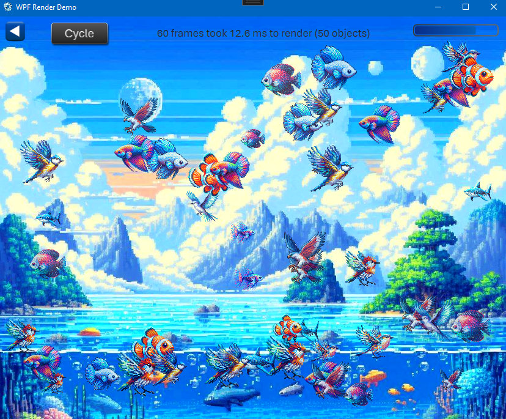

## 💻 WPF - Game Engine Render Demo

**Dependencies**

| Assembly | Version |
| ---- | ---- |
| NET Core | 8.0 |

### 📝 v1.0.0.0 - November 2024

* A simple game loop render demo.

* WPF applications use DirectDraw/DirectX for rendering to the GPU. This example project uses only the CPU to render moving objects but can easily handle 500+ objects moving and still remain performant.

* There is no collision detection or map loading routine as these depend on the type of game you're making. This is only an underpinning to show how the rendering of the main game loop can work.

* I have provided two `RenderObjects` in this solution:

	> `RectangleObject`, which uses [RectangleGeometry](https://learn.microsoft.com/en-us/dotnet/api/system.windows.media.rectanglegeometry?view=windowsdesktop-8.0)
	
	> `ImageObject`, which uses [Image](https://learn.microsoft.com/en-us/dotnet/api/system.windows.controls.image?view=windowsdesktop-9.0) (can be used for sprites)

* Other possible options include the [ImageBrush](https://learn.microsoft.com/en-us/dotnet/api/system.windows.media.imagebrush?view=windowsdesktop-8.0), [EllipseGeometry](https://learn.microsoft.com/en-us/dotnet/api/system.windows.media.ellipsegeometry?view=windowsdesktop-8.0), [LineGeometry](https://learn.microsoft.com/en-us/dotnet/api/system.windows.media.linegeometry?view=windowsdesktop-8.0) et. al.

* It is also possible to [host Direct3D](https://learn.microsoft.com/en-us/dotnet/desktop/wpf/advanced/walkthrough-hosting-direct3d9-content-in-wpf?view=netframeworkdesktop-4.8) content in a WPF application.

## 🧾 License/Warranty
* Permission is hereby granted, free of charge, to any person obtaining a copy of this software and associated documentation files (the "Software"), to deal in the Software without restriction, including without limitation the rights to use, copy, modify, merge, publish and distribute copies of the Software, and to permit persons to whom the Software is furnished to do so, subject to the following conditions: The above copyright notice and this permission notice shall be included in all copies or substantial portions of the Software.
* The software is provided "as is", without warranty of any kind, express or implied, including but not limited to the warranties of merchantability, fitness for a particular purpose and noninfringement. In no event shall the author or copyright holder be liable for any claim, damages or other liability, whether in an action of contract, tort or otherwise, arising from, out of or in connection with the software or the use or other dealings in the software.
* Copyright © 2024. All rights reserved.

## 📋 Proofing
* This application was compiled and tested using *VisualStudio* 2022 on *Windows 10* versions **22H2**, **21H2** and **21H1**.
